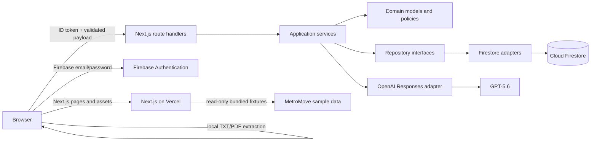
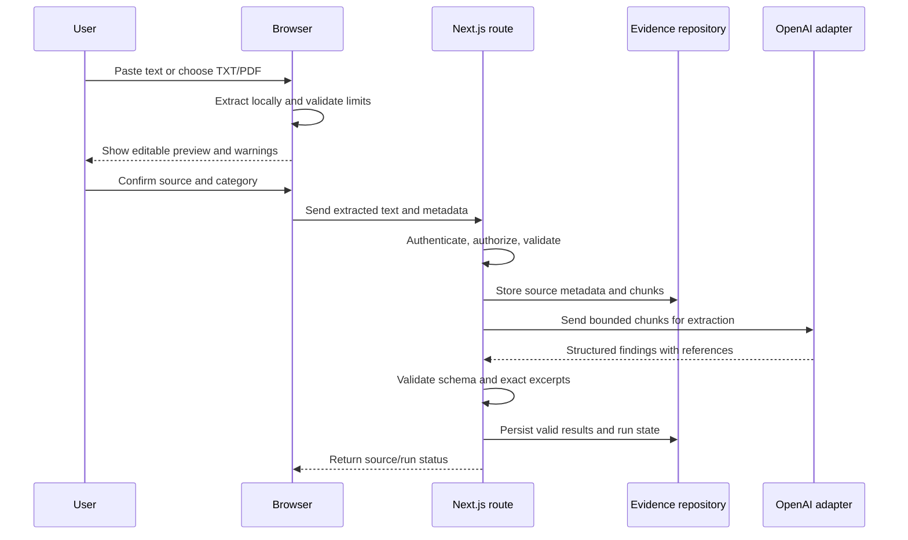

# Practero MVP Architecture

**Status:** Proposed architecture; implementation has not started.

## Architecture goals

- Deliver one polished, traceable MetroMove workflow quickly.
- Keep domain and application logic independent of Firebase and OpenAI SDK types.
- Keep secrets, privileged persistence, and model calls on the server.
- Store only bounded text and structured analysis data.
- Make the public demo immediate while keeping private engagements private.
- Preserve a practical path from Firestore to a relational backend later.

## System context



The deployable unit is a single Next.js application. There are no Firebase Cloud Functions, Storage buckets, background workers, or separate application servers in the MVP.

## Proposed source layout

```text
src/
  app/
    (marketing)/
    demo/metromove/
    engagements/
    api/
  components/
  domain/
    entities/
    policies/
    repositories/
  application/
    services/
  infrastructure/
    firebase/
    openai/
    demo/
    documents/
  lib/
  schemas/
  types/
sample-data/
  metromove/
tests/
  unit/
  integration/
  e2e/
```

The exact route grouping can change during scaffolding, but dependencies must continue to point inward: presentation and infrastructure may depend on application/domain contracts; domain code must not import Next.js, Firebase, or OpenAI packages.

## Client and server boundaries

### Browser responsibilities

- Render the interface and manage local interaction state.
- Authenticate with the Firebase Web SDK using email/password.
- Obtain an ID token and send it to same-origin route handlers.
- Accept pasted text and selected files.
- Extract TXT and PDF text locally, show a preview, and enforce preliminary limits.
- Never receive `OPENAI_API_KEY`, Firebase Admin credentials, or service-account material.
- Never write directly to Firestore from a presentation component.

Client components should be limited to forms, filters, drawers, file extraction, and other interaction-heavy islands. Pages and read-heavy layouts should use React Server Components where practical.

### Next.js server responsibilities

- Verify Firebase ID tokens for every private operation.
- Resolve the authenticated user and enforce engagement ownership.
- Validate request payloads with Zod.
- Coordinate repository operations through application services.
- Call the OpenAI Responses API and validate Structured Outputs.
- Validate source references against stored chunks before persistence.
- Apply deterministic severity and readiness policies.
- Return safe, structured errors without secret or provider-detail leakage.

### Proposed route surface

| Route | Purpose | Access |
| --- | --- | --- |
| `GET /demo/metromove` | Read-only seeded demonstration | Public |
| `POST /api/engagements` | Create a private engagement | Authenticated |
| `GET /api/engagements/:id` | Load an owned engagement | Owner |
| `POST /api/engagements/:id/evidence` | Persist reviewed source text as chunks | Owner |
| `POST /api/engagements/:id/analysis/extract` | Extract one or more pending sources | Owner; demo live-run policy optional |
| `POST /api/engagements/:id/analysis/gaps` | Compare validated extracted findings | Owner; demo live-run policy optional |
| `POST /api/engagements/:id/deployment-plan` | Generate plan and Executive Brief | Owner; demo live-run policy optional |

The final implementation may combine internal endpoints to simplify the UI, but each stage must remain separately validated and observable. Route handlers should be thin; orchestration belongs in application services.

## Application and repository boundaries

Core contracts should include:

```ts
interface EngagementRepository { /* owned engagement operations */ }
interface EvidenceRepository { /* source metadata and chunk operations */ }
interface AnalysisRepository { /* runs, extracted items, gaps */ }
interface DeploymentPlanRepository { /* plans, workstreams, brief */ }
```

Repositories accept and return domain types, not Firestore snapshots, timestamps, references, or field-value sentinels. Infrastructure adapters own serialization. Application services own workflows and authorization preconditions. Deterministic policies—severity, readiness, reference matching, and plan ordering—remain pure functions.

The public MetroMove implementation uses the same repository contracts with a read-only fixture adapter. This keeps the demo path representative without granting public Firestore writes.

## Firebase usage

### Firebase Authentication

- Enable Email/Password authentication.
- Use the Firebase Web SDK only for browser authentication.
- Send the current ID token to same-origin API routes using an authorization header.
- Verify tokens using Firebase Admin on the server.
- Treat token verification as authentication only; always perform an engagement ownership check as authorization.

### Cloud Firestore

- Use Firestore for private engagement metadata, evidence chunks, analysis runs, structured findings, gaps, plans, and activity events.
- Do not store original files or oversized unchunked extracted text.
- Access Firestore through server-side repository adapters in the initial architecture.
- Keep deny-by-default security rules even though Firebase Admin bypasses rules; route-level authorization is mandatory.
- Avoid listeners unless the UI has a demonstrated need. Normal request/response reads reduce complexity for the MVP.

The public MetroMove dataset should be versioned under `sample-data/metromove` and served read-only. If a later decision moves demo records into Firestore, they must live in a separately readable, non-sensitive namespace with all writes denied.

## OpenAI integration

All model traffic goes through `src/infrastructure/openai` from secure Next.js route handlers. The adapter should use the official JavaScript SDK and the Responses API with Structured Outputs. Zod schemas are the application source of truth and are passed through the SDK’s Zod helper, then validated again at the domain boundary.

Proposed model policy:

- **Evidence extraction:** `gpt-5.6-luna`, low reasoning, because it is the cost-sensitive GPT-5.6 tier.
- **Cross-source gap analysis:** `gpt-5.6-terra`, medium reasoning as the initial quality/cost balance.
- **Deployment plan:** `gpt-5.6-terra`, low or medium reasoning after evaluation.
- **Quality-first fallback:** the `gpt-5.6` alias (GPT-5.6 Sol) only if representative evals show that Terra misses material gaps and the budget allows it.

Model IDs and reasoning settings should be server configuration with safe defaults, not client-controlled values. Pinning a dated model snapshot can be considered after the demo prompts and eval set stabilize.

OpenAI’s current documentation confirms that GPT-5.6 supports the Responses API and Structured Outputs, recommends Luna for efficient high-volume work and Terra for a cost/quality balance, and recommends Structured Outputs over JSON mode. See [model guidance](https://developers.openai.com/api/docs/guides/latest-model), [GPT-5.6 Sol](https://developers.openai.com/api/docs/models/gpt-5.6-sol), and [Structured Outputs](https://developers.openai.com/api/docs/guides/structured-outputs).

## Document-processing flow



Initial file behavior:

- Pasted text and TXT use native browser APIs.
- PDF extraction uses a browser-compatible PDF parser loaded only on the evidence screen.
- Original file bytes are not sent to Firestore or retained by the application.
- The user must inspect extracted text before analysis.
- Five-source, 60,000-character-per-source, and 180,000-total-character limits are enforced on both client and server.
- Chunking occurs on the trusted server after submission so offsets and hashes are canonical.
- Unsupported, encrypted, image-only, or failed PDFs receive explicit errors. OCR is out of scope.
- DOCX stays deferred until the core flow passes its acceptance tests.

## Public demo design

The no-account MetroMove route loads versioned fictional evidence, extracted findings, gaps, and a deployment plan from the fixture repository. Seeded output must be labeled “Sample analysis.” During Phase 1 these are schema-valid design fixtures; before release they must be refreshed or certified as a captured output of the real pipeline and pass the same reference, severity, readiness, and plan-link validation. This guarantees a dependable judge path without pretending a model ran on page load, making public collections writable, or consuming model budget on every visit.

The application may additionally expose “Run live analysis” when server configuration and spend controls are present. That action uses the real analysis services and is labeled “Live analysis.” Its failure must not destroy or masquerade as the seeded result. A live demo write should use an ephemeral server-side run or an authenticated private copy; anonymous users do not receive general Firestore write access.

## Security model

### Trust boundaries

- Browser input, filenames, source categories, IDs, and model output are untrusted.
- Only verified Firebase tokens establish user identity.
- Only a server-side engagement lookup establishes ownership.
- OpenAI output is data to validate, never executable instructions.

### Controls

- Store secrets only in local/Vercel environment variables. Never expose Admin or OpenAI values with a `NEXT_PUBLIC_` prefix.
- Do not log evidence bodies, excerpts, authorization headers, ID tokens, or provider responses in production.
- Use Zod validation on every API boundary and reject unknown/oversized payloads.
- Normalize and validate document metadata; never trust a file extension alone.
- Use strict Content Security Policy and standard secure headers once UI dependencies are known.
- Protect state-changing routes against cross-origin use with same-origin checks and an explicit authorization header.
- Set per-user concurrency and run limits for analysis routes; apply stricter public-demo limits.
- Give provider failures stable internal codes and sanitized user messages.
- Deny public Firestore access by default. Rules should permit only explicitly designed access patterns.
- Keep service-account JSON out of the repository; use individual environment variables for Admin initialization.
- Maintain a separate Firebase project and OpenAI project/key for development and production when practical.

OpenAI recommends keeping API keys out of source and public repositories and exposing them through environment variables or secret management; see [production best practices](https://developers.openai.com/api/docs/guides/production-best-practices).

## Deployment architecture

### Vercel

- Deploy the single Next.js application from the public GitHub repository.
- Configure Firebase public web values and server-only Firebase Admin/OpenAI values in Vercel project settings.
- Use Node.js route handlers for Firebase Admin and the OpenAI SDK.
- Configure stage-specific request timeouts below the verified Vercel execution limit and show a recoverable timeout state.
- Run lint, typecheck, tests, and production build in CI before deployment.

### Firebase

- Use one Firebase project for the public demo environment and optionally a separate development project.
- Enable Authentication and Firestore only.
- Deploy reviewed security rules and required indexes manually or through a narrow CI step added later.
- Add the Vercel domain to Firebase Authentication authorized domains.

### OpenAI

- Use a project-scoped API key with project budget alerts and spend limits.
- Record request IDs, stage, model, latency, token usage, and outcome without recording source bodies.
- Keep the seeded demo available if live analysis is rate-limited or unavailable.

## Reliability and observability

- Persist an analysis run before calling the model and move it through explicit queued/running/succeeded/failed/partial states.
- Make operations idempotent using a run ID plus content hashes.
- Retry only bounded transient failures and one malformed structured output; never create an unbounded retry loop.
- Keep prior successful analysis visible until a replacement run succeeds.
- Store safe failure codes and timestamps, not raw provider exceptions.
- Use structured server logs with engagement IDs hashed or omitted in public environments.
- Track stage-level duration and token usage to expose cost regressions.

## Migration considerations

Firestore is an adapter, not the domain model. To preserve migration options:

- use string IDs and ISO/domain dates at boundaries rather than exposing Firestore types;
- keep repository methods aligned with aggregate operations rather than document primitives;
- duplicate query fields only inside Firestore serializers;
- do not embed Firestore paths in evidence references;
- represent relationships with domain IDs;
- version AI output schemas and sample fixtures;
- keep deterministic policies free of provider dependencies;
- provide export/import scripts later that operate on domain DTOs.

A later PostgreSQL adapter could map engagements, sources, chunks, findings, gaps, references, workstreams, and tasks to normalized tables without changing UI contracts or core policies.

## Architecture decisions to validate during implementation

1. Verify PDF parser compatibility with the chosen Next.js/browser bundle before adding DOCX.
2. Evaluate Luna extraction and Terra gap analysis against the canonical MetroMove fixtures before considering Sol.
3. Confirm Vercel runtime duration and request-body limits for the selected plan before finalizing stage timeouts.
4. Confirm whether anonymous live demo analysis is worth its abuse/cost surface; seeded analysis remains the required fallback.
5. Validate Firestore document sizes with worst-case fixture records, not only average sample data.
