# Practero Hackathon Implementation Plan

**Status:** Proposal for review. No feature implementation has started.

## Current repository baseline

At the time of this planning pass, the repository contains:

- an Apache License 2.0 `LICENSE`;
- a one-line `README.md`;
- a comprehensive Node/Next.js-oriented `.gitignore`; and
- an ignored `.env.local`, whose contents were not inspected.

There is no application scaffold, package manifest, source directory, test configuration, Firebase configuration, sample data, or CI workflow yet. The existing `.gitignore` has an uncommitted user change that explicitly ignores local environment variants; it should be preserved.

## Delivery strategy

Build the smallest demonstrable path first, then replace each seeded boundary with a live implementation. Keep the MetroMove journey continuously runnable. A phase is complete only when its exit criteria pass; partially wired controls are not presented as finished.

## Phase 1 — Foundation and static vertical slice

### Deliverables

- Scaffold Next.js App Router, strict TypeScript, Tailwind CSS, ESLint, Vitest, and Playwright with compatible stable versions.
- Establish the proposed `src` boundaries and shared UI foundations.
- Define domain types, Zod schemas, severity/readiness policies, and reference mapping utilities.
- Create safe fictional MetroMove evidence in all three realities plus versioned expected analysis fixtures.
- Build the read-only end-to-end interface: landing, dashboard, evidence, Reality Map, Reality Gaps/detail, Deployment Path, and Executive Brief.
- Label all fixture-derived analysis as “Sample analysis.”
- Add responsive navigation, keyboard basics, and loading/empty/error component patterns.
- Add unit tests for deterministic policies and fixture-schema validation.

### Exit criteria

- A judge can complete the full MetroMove story without auth, Firebase, or OpenAI configuration.
- Every displayed seeded finding links to an exact fixture excerpt.
- No control implies live persistence or live analysis.
- Lint, strict typecheck, unit tests, and production build pass.

## Phase 2 — Firebase authentication and evidence persistence

### Deliverables

- Configure Firebase Web Auth for email/password and Firebase Admin for server routes.
- Implement auth/session UI and owner-only route behavior.
- Implement repository interfaces plus Firestore and read-only demo adapters.
- Create private engagements and persist evidence metadata/chunks through application services.
- Add pasted text, TXT extraction, and local PDF extraction with preview and explicit limits.
- Add Firestore rules, index configuration as needed, emulator-backed or isolated integration tests, and safe errors.

### Exit criteria

- A user can sign up/sign in, create an engagement, add/reopen reviewed evidence, and sign out.
- Another authenticated user cannot discover or access that engagement.
- No original file is stored or sent beyond local extraction.
- Chunk reconstruction, ownership, and persistence integration tests pass.

## Phase 3 — GPT-5.6 evidence extraction

### Deliverables

- Implement the server-only OpenAI adapter using Responses API Structured Outputs.
- Add versioned extraction prompts and Zod candidate schemas.
- Use GPT-5.6 Luna with bounded output and low reasoning initially.
- Validate exact excerpts, offsets, source IDs, chunk IDs, and hashes.
- Persist extraction runs and valid Reality Map items with explicit run states.
- Implement bounded timeout, retry, refusal, malformed-output, partial-run, and cost-usage handling.
- Add mocked provider integration tests and the canonical MetroMove extraction eval.

### Exit criteria

- At least one private evidence source can be extracted live into a valid Reality Map.
- Fabricated or approximate excerpts cannot be persisted as valid evidence.
- A malformed or failed provider response leaves evidence intact and yields a recoverable state.
- Model, prompt/schema version, latency, and token usage are recorded without logging evidence bodies.

## Phase 4 — Reality Gap Engine and grounded interface

### Deliverables

- Implement cross-source comparison on validated extracted items using GPT-5.6 Terra initially.
- Add gap-type schemas, sufficiency rules, deterministic severity, confidence adjustments, deduplication, and unresolved-question handling.
- Persist gap-analysis runs without replacing the last successful run until completion.
- Connect the polished gap list/detail interface to live records.
- Show side-by-side evidence from the relevant realities and stale-analysis warnings when sources change.
- Add tests for required MetroMove gaps, prohibited unsupported claims, and coverage rules.

### Exit criteria

- A live run detects the canonical MetroMove gap families within the accepted eval tolerance.
- Contradictions show evidence for both sides; invalid coverage becomes an unresolved question.
- Gap severity is reproducible from stored inputs.
- Users can navigate source → item → gap and gap → source excerpt.

## Phase 5 — Deployment Path, Executive Brief, and readiness

### Deliverables

- Generate workstreams, engineering tasks, stakeholder actions, dependencies, acceptance criteria, risks, mitigations, checklist items, and Executive Brief fields.
- Validate every generated action against existing gap IDs.
- Detect dependency cycles and apply stable priority ordering.
- Compute readiness in deterministic code and explain that it is a Practero assessment.
- Link gaps and workstreams in both directions.
- Add live/seeded state labels to the final outputs.

### Exit criteria

- Every workstream traces to at least one gap.
- Critical/high blockers visibly influence ordering and readiness.
- The Executive Brief contains no unsupported new facts.
- The full private live path and public seeded path both remain usable.

## Phase 6 — Hardening, open-source release, and demo preparation

### Deliverables

- Complete unit and integration coverage for schemas, policies, reference mapping, failures, and persistence.
- Add the required Playwright journey: open MetroMove, inspect evidence, view/run analysis, open a gap, inspect evidence, and view Deployment Path.
- Perform keyboard, focus, semantic HTML, contrast, reduced-motion, responsive, and screen-reader-label checks.
- Add rate/concurrency controls, safe headers, sanitized logging, and final Firestore-rule review.
- Configure CI for lint, typecheck, tests, Playwright as practical, and production build.
- Deploy to Vercel and run the judge journey against production.
- Complete `README.md`, `CONTRIBUTING.md`, `CODE_OF_CONDUCT.md`, `SECURITY.md`, `docs/demo-guide.md`, and `docs/codex-build-log.md` truthfully.
- Prepare a sub-three-minute video script and a no-assistance judging checklist.

### Exit criteria

- CI and production smoke tests pass from a clean checkout.
- Required environment/setup instructions are reproducible.
- The demo survives unavailable live analysis by retaining clearly labeled seeded output.
- The release MetroMove snapshot is generated or certified through the implemented pipeline and passes the same validation as live results.
- Documentation describes only implemented behavior and known limitations.

## Critical path

```mermaid
flowchart LR
    A[Scaffold and quality gates] --> B[Domain schemas and policies]
    B --> C[MetroMove evidence and exact references]
    C --> D[Static traceable judge journey]
    D --> E[Auth and repository boundary]
    E --> F[Evidence ingestion and chunk persistence]
    F --> G[Structured extraction and reference validation]
    G --> H[Cross-source gap analysis]
    H --> I[Deployment plan and readiness]
    I --> J[E2E hardening and production deploy]
```



The critical product seam is not merely the model call; it is **canonical evidence → valid reference → gap → implementation action**. Work that does not strengthen or demonstrate that chain is secondary until it is reliable.

## Recommended first coding milestone

### Milestone: MetroMove read-only traceability slice

Build a deployable, no-configuration vertical slice from landing page to Deployment Path using validated fixtures.

It should include:

1. Next.js/TypeScript/Tailwind/Vitest/Playwright foundations.
2. Domain/Zod schemas for evidence, extracted items, references, gaps, workstreams, and readiness.
3. The five fictional MetroMove sources with stable chunks and exact offsets.
4. A public `/demo/metromove` journey through dashboard, evidence, Reality Map, gap list/detail, Deployment Path, and Executive Brief.
5. The connectivity gap as the centerpiece, showing organizational, field, and technical excerpts side by side.
6. Pure tested functions for reference validation, severity, readiness, and plan ordering.
7. Clear “Sample analysis” labeling and no nonfunctional live-analysis button.
8. Passing lint, strict typecheck, unit tests, production build, and a Playwright smoke path.

This milestone validates the domain model, information architecture, design language, sample narrative, and most important traceability interaction before Firebase or model integration adds failure modes.

## Major risks and mitigations

| Risk | Why it matters | Mitigation / decision gate |
| --- | --- | --- |
| Model produces plausible but unsupported gaps | Trust and differentiation collapse | Exact reference validation, category coverage rules, unresolved-question fallback, canonical evals |
| Hackathon scope expands into a PM suite | Core journey remains unfinished | Freeze non-goals; require every new feature to strengthen the evidence-to-plan chain |
| Public live analysis creates spend/abuse risk | Demo can be exhausted or become costly | Seeded default, explicit live label, per-user/public limits, project spend controls |
| PDF extraction is inconsistent | Users may analyze missing/garbled text | Local preview, explicit image-only/encrypted errors, defer OCR/DOCX |
| Firestore record limits or weak data access patterns | Persistence fails late | Chunk early, bound arrays/strings, worst-case fixture size tests, repository abstraction |
| Admin SDK bypasses Firestore rules | A route bug could expose private data | Mandatory token verification + parent ownership check in application services; deny direct clients |
| Serverless timeout during multi-stage analysis | Judge sees stalled/failed flow | Separate idempotent stages, configurable timeouts, preserved last success, seeded fallback |
| Model tier/effort is chosen by intuition | Cost rises without better results | Evaluate Luna/Terra/Sol and reasoning settings on representative fixtures |
| Seeded output is mistaken for live output | Misrepresents the project | Persistent “Sample analysis” vs “Live analysis” provenance labels |
| UI polish is attempted before evidence semantics stabilize | Rework consumes demo time | Lock domain schemas/fixtures and centerpiece detail layout in milestone 1 |
| Open-source release leaks credentials or private evidence | Security and trust failure | Never inspect/commit local secrets; secret scanning; fictional fixtures; clean-checkout review |
| Required documentation trails implementation | Judges cannot reproduce or trust claims | Update build log and relevant docs in the same change as each material feature |

## Scope cuts if time becomes limited

Cut in this order while preserving the central demonstration:

1. DOCX support, OCR, and any non-TXT/PDF format.
2. Anonymous “Run live analysis”; keep the seeded judge path and authenticated live pipeline.
3. Rich activity feed; keep only essential run/source status.
4. Advanced filters, saved views, bulk actions, and status editing.
5. Executive Brief download/export; keep the on-screen brief.
6. Multiple plan versions and historical comparison; keep the last successful run plus provenance.
7. Custom dashboard charts and decorative motion.
8. Optional profile settings and account-management polish beyond sign-in/sign-out.

Do **not** cut: the immediate MetroMove route, the three realities, exact source evidence, the Reality Gap detail experience, seeded/live provenance, deterministic severity/readiness, Deployment Path traceability, safe failure states, or the required end-to-end test.

## Required manual setup

### Firebase

1. Create a Firebase project for development/demo and register a Web app.
2. Enable Email/Password in Authentication providers.
3. Create Cloud Firestore in the intended region; do not enable Storage or paid extensions.
4. Create server credentials for Firebase Admin and place the project ID, client email, and newline-correct private key in local/Vercel server-only environment variables. Do not download a service-account JSON into the repository.
5. Set the public Firebase web config values in `.env.local` and Vercel project settings.
6. Add localhost and the final Vercel domain to authorized Authentication domains.
7. Review and deploy deny-by-default Firestore rules plus only the indexes proven necessary by implementation.
8. Create two test accounts to verify cross-user isolation.
9. Confirm Firebase usage/budget settings and that the MVP uses only Authentication and Firestore on the intended no-cost plan at demo scale.

Expected Firebase variable names:

```text
NEXT_PUBLIC_FIREBASE_API_KEY
NEXT_PUBLIC_FIREBASE_AUTH_DOMAIN
NEXT_PUBLIC_FIREBASE_PROJECT_ID
NEXT_PUBLIC_FIREBASE_APP_ID
FIREBASE_ADMIN_PROJECT_ID
FIREBASE_ADMIN_CLIENT_EMAIL
FIREBASE_ADMIN_PRIVATE_KEY
```

### OpenAI

1. Create or select an OpenAI API project dedicated to Practero.
2. Confirm the project can access the required GPT-5.6 model tiers.
3. Create a project-scoped API key and store it only as `OPENAI_API_KEY` locally and in Vercel.
4. Configure project spend limits/budget alerts appropriate for the demo.
5. Choose server-only model configuration defaults: Luna extraction and Terra analysis/planning initially.
6. Run the canonical fixture eval and record quality, latency, token usage, and request IDs before enabling live demo analysis.
7. Revoke any key that is exposed in logs, source, screenshots, or demo materials.

### Vercel and release

1. Import the public repository into Vercel.
2. Add environment variables separately for preview and production.
3. Confirm Node runtime and function limits for the chosen plan before setting analysis timeouts.
4. Deploy, then run the complete MetroMove Playwright/smoke journey against the production URL.

## Approval gates

User review is required before scaffolding or feature implementation. During implementation, pause for a scope decision if:

- live anonymous demo analysis would require a materially different abuse/cost design;
- the chosen PDF parser threatens delivery or demands a server upload flow;
- Firebase access requires broader client permissions than this architecture;
- canonical evals require Sol by default rather than the planned Terra configuration; or
- a requested feature falls outside the documented MVP/non-goals.
